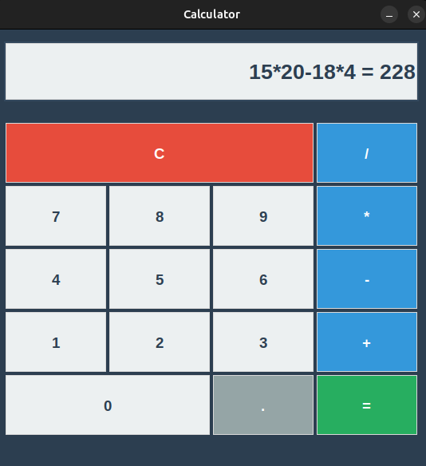

# GUI Calculator

A simple calculator application built with Python's <b>(Tkinter library)</b>. This project provides a graphical user interface (GUI) for performing basic arithmetic operations such as addition, subtraction, multiplication, and division.

## Usage

1. Run the calculator from the command line:

    ```sh
    python TK_calculator.py
    ```

   

## Features

- User-friendly GUI with clickable buttons
- Supports addition, subtraction, multiplication, and division
- Input field displays current expression and results
- Handles decimal numbers
- Clear button to reset the calculation
- Responsive layout


## ⚠️ Security Note

This is a learning/demo project. Avoid using `eval` (or similar dynamic code execution) on user input in your own applications. `eval` can execute arbitrary code, which poses serious security risks. If any example code here uses `eval`, it is strictly for educational purposes—use a safe expression parser or a vetted math library in production.


