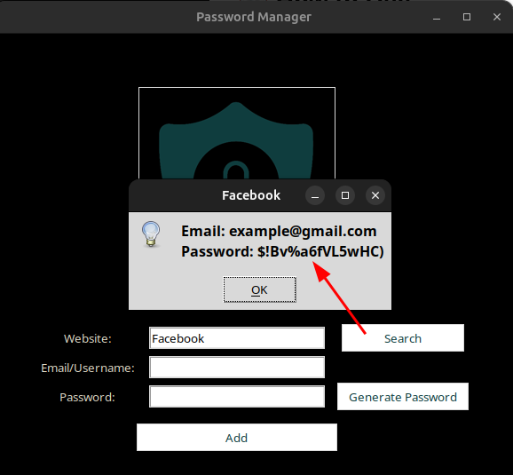

# 🔐 Password Manager

A secure desktop password manager built with <b>Python</b> and <b>Tkinter</b> that helps you generate, store, and retrieve passwords for your online accounts.

<div align="center">
  
</div>

## ✨ Features

- **🔑 Password Generation**: Generate strong, secure passwords with letters, numbers, and symbols
- **💾 Password Storage**:  store passwords with associated websites and email addresses
- **🔍 Password Search**: Quickly find and retrieve saved passwords by website name
- **🖥️ Desktop Interface**: Clean, intuitive GUI built with (Tkinter)
- **📱 Cross-Platform**: Works on Windows, macOS, and Linux
- **💾 JSON Storage**: Passwords stored in a simple, readable JSON format

## 🚀 Getting Started


### Installation

1. Clone the repository:
   ```bash
   git clone https://github.com/0xYousefTaha/Python_Projects.git
   cd "5-Password_manager (Desktop-version)"
   ```

2. Run the application:
   ```bash
   python main.py
   ```

## 📖 How to Use

### Adding a New Password

1. Enter the website name in the "Website" field
2. Enter your email/username in the "Email/Username" field
3. Either:
   - Enter your own password in the "Password" field, or
   - Click "Generate Password" to create a secure random password
4. Click "Add" to save the password

### Finding a Saved Password

1. Enter the website name in the "Website" field
2. Click "Search"
3. A popup will display the saved email and password for that website
   


## 🔧 Technical Details

### Dependencies

- **tkinter**: GUI framework (built-in with Python)
- **json**: Data serialization (built-in with Python)
- **random**: Password generation utilities (built-in with Python)
- **os**: Operating system interface (built-in with Python)


### Cross-Platform Compatibility

The application automatically detects the operating system and uses the appropriate icon format:
- **Windows**: Uses `.ico` files with `iconbitmap()`
- **Linux/macOS**: Uses `.png` files with `iconphoto()`

## 🛡️ Security Notes

⚠️ **Important Security Considerations**:

- This is a basic password manager for educational purposes
- Passwords are stored in plain text JSON format
- For production use, consider adding encryption
- Do not share your `data.json` file with others


## 🙏 Acknowledgments

- Built as part of the Python learning journey
- Uses Tkinter for the GUI framework
- Security icon from free icon resources

---

**Happy Password Managing! 🔐**
