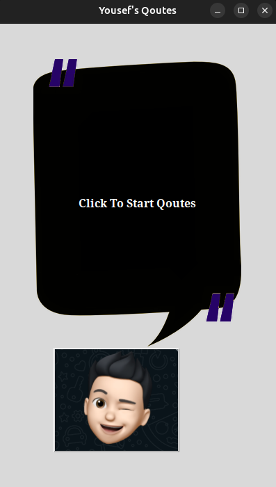
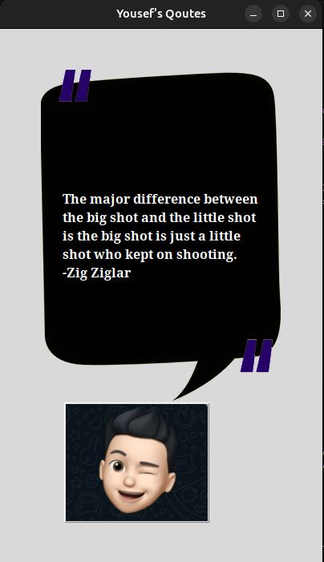

## Yousef's favorite Quotes (Desktop App)

A simple desktop app that fetches random inspirational quotes from the ZenQuotes API and displays them in a clean Tkinter UI. Click the avatar button to cycle through quotes.

### Features
- **Random quotes**: Pulls fresh quotes from `https://zenquotes.io/api/quotes`.
- **Lightweight UI**: Built with Python's `tkinter`.
- **Offline-friendly after fetch**: Quotes are fetched once at startup and then displayed locally.

### Preview


## Requirements
- Internet access on first launch (to fetch quotes)
- Python packages:
    - `requests`

## Installation
```bash
python -m venv .venv
source .venv/bin/activate  # On Windows: .venv\\Scripts\\activate
pip install --upgrade pip
pip install requests
```

## Run
```bash
python main.py
```

## How it works
- On startup, the app requests all quotes from the ZenQuotes API and stores them in memory.
- Clicking the avatar button selects a random quote and author and updates the canvas text.
- Images are loaded from the `assets/` directory.


Key parts (see `main.py`):
- `API_END_POINT = "https://zenquotes.io/api/quotes"`
- `get_quote()` randomizes and updates the canvas text item
- `tkinter.Canvas` and `PhotoImage` are used for UI and images


